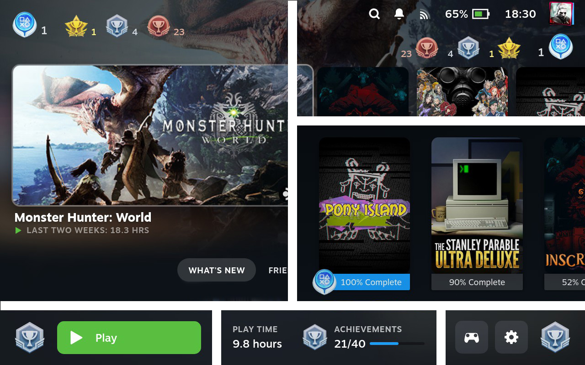

# 🏆 Steam Deck Trophies

Display your achievement trophies on home, library and game pages

## Features
- Display your achievements trophy on a game page
- Display your achievements trophies summary on home page
- Display platinum trophies on library page
- Customize position of trophies or hide them.

## How it works
Plugin shows a per game trophy based on percentage of unlocked achievements  
- Bronze: 0-33% 
- Silver: 33-66% 
- Golden: 66-99% 
- Platinum: 100% 

## Installation
1. [Install the Decky Loader](https://github.com/SteamDeckHomebrew/decky-loader#installation)
2. Use the built-in plugin store to download the **Trophies** plugin

## Usage
- Press the  button to open Quick Access Menu (QAM)
- Navigate to the  icon
- Click "Trophies" item and customize the plugin settings